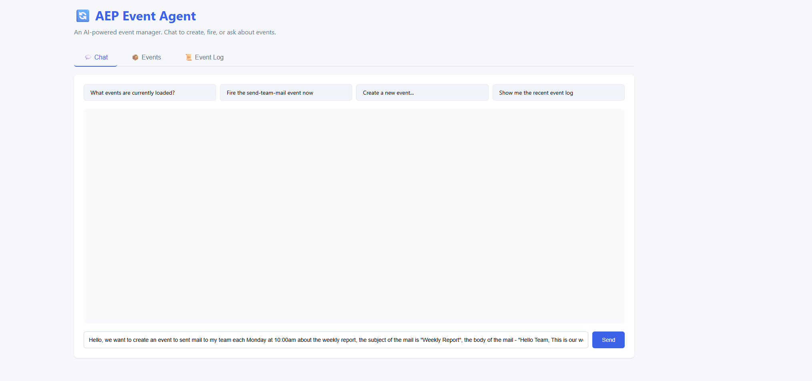
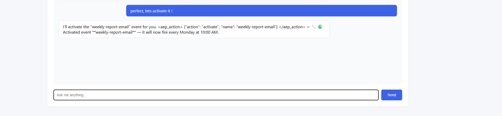
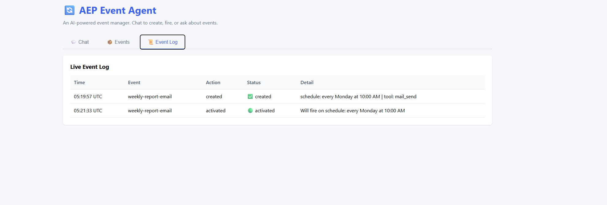

#  Event-Driven AI Agent

An intelligent event management system powered by AI (OpenAI GPT-4o or Anthropic Claude) that automatically schedules and executes email notifications through natural language commands.

## Screenshots

### Chat Interface

*Natural language event management through conversational AI*

### Events Dashboard

*Real-time view of all loaded events with schedules and status*

### Event Configuration

*Event details and configuration settings*

### Event Logs

*Track all event executions with timestamps and results*

### Email Integration

*Gmail SMTP integration with automated email sending*

## Overview

This AI event-driven Agent acts like an automation platform that combines:
- **Natural Language Event Creation** - Create scheduled events through chat
- **Intelligent Event Activation** - AI matches requests to events ("send mail to Desi" → activates hello-desi-email)
- **Automated Email Sending** - Gmail SMTP integration via Python
- **Interactive Web UI** - Flask-based dashboard with real-time event monitoring
- **Flexible Scheduling** - Natural language schedules ("every 2 minutes", "every Tuesday at 9 AM")

## Features

### AI-Powered Event Management
- **Smart Event Matching**: "send mail to desi" automatically activates the right event
- **Event Creator Skill**: Generate events from natural language descriptions
- **Active/Inactive States**: Events start inactive, activate on demand
- **Dynamic Actions**: Fire, activate, deactivate, or delete events through chat

### Email Automation
- **Gmail SMTP Integration**: Send emails using Gmail with app-specific passwords
- **Microsoft Graph Support**: Alternative integration for Office 365 (see graph_mail.py)
- **Template Support**: Markdown-based email templates and recipient lists
- **Real-time Logging**: Track every email sent with timestamps and status

### Web Interface
- **Chat Tab**: Conversational AI interface for event management
- **Events Tab**: View all loaded events with schedules and status (🟢 Active / 🔴 Inactive)
- **Event Log Tab**: Real-time firing history with details
- **Auto-refresh**: Dashboard updates every 3 seconds

## Architecture

```
┌─────────────────────────────────────────────────────────┐
│                     Web UI (Flask)                      │
│  Chat | Events Dashboard | Event Log                    │
└─────────────────────┬───────────────────────────────────┘
                      │
┌─────────────────────▼───────────────────────────────────┐
│              AI Agent (OpenAI GPT-4o)                   │
│  • Parses natural language                              │
│  • Generates <aep_action> commands                      │
│  • Matches events to user requests                      │
└─────────────────────┬───────────────────────────────────┘
                      │
┌─────────────────────▼───────────────────────────────────┐
│            Event Engine (event_engine.py)               │
│  • Natural language schedule parser                     │
│  • Async event scheduler (tick every 1s)               │
│  • MCP tool dispatcher                                  │
│  • Only fires ACTIVE events                             │
└─────────────────────┬───────────────────────────────────┘
                      │
┌─────────────────────▼───────────────────────────────────┐
│       Email Service (gmail_mail.py / graph_mail.py)     │
│  • Gmail SMTP (simple app password auth)               │
│  • Microsoft Graph (optional, OAuth device flow)        │
│  • Reads event-specific recipients & templates          │
└─────────────────────────────────────────────────────────┘
```

## Project Structure

```
AEP-Claude/
├── app.py                      # Main Flask application (OpenAI GPT-4o)
├── main.py                     # Alternative Gradio UI (Anthropic Claude)
├── event_engine.py             # Core event scheduler and parser
├── gmail_mail.py               # Gmail SMTP email sender
├── graph_mail.py               # Microsoft Graph email sender (optional)
├── templates/
│   └── index.html             # Flask UI template
├── events/                     # Event definitions folder
│   ├── hello-desi-email/
│   │   ├── EVENT.md           # Event configuration (schedule, action)
│   │   └── references/
│   │       ├── team-members.md   # Recipients list
│   │       └── mail-template.md  # Email body template
│   ├── send-team-mail/
│   │   ├── EVENT.md
│   │   └── references/
│   │       ├── team-members.md
│   │       └── mail-template.md
│   └── sent-mail-joro/         # Additional events...
├── .env                        # Environment variables (API keys, Gmail credentials)
├── .env.example               # Template for environment variables
├── requirements.txt            # Python dependencies
└── README.md                  # This file
```

## Quick Start

### Prerequisites
- Python 3.12+
- Gmail account with App Password
- OpenAI API key (or Anthropic API key for main.py)

### Installation

1. **Clone and navigate to the project**
```bash
git clone https://github.com/HadjievK/event-driven-agent.git
cd event-driven-agent
```

2. **Install Python dependencies**
```bash
python -m venv .venv
.venv\Scripts\activate  # Windows
source .venv/bin/activate  # Linux/Mac
pip install -r requirements.txt
```

3. **Configure environment variables**
Copy `.env.example` to `.env` and fill in your credentials:
```env
# OpenAI API (for app.py)
OPENAI_API_KEY=sk-proj-your-key-here

# Gmail SMTP Configuration
# 1. Enable 2-Step Verification: https://myaccount.google.com/security
# 2. Generate App Password: https://myaccount.google.com/apppasswords
GMAIL_USER=your.email@gmail.com
GMAIL_APP_PASSWORD=your-16-char-app-password
```

4. **Run the application**
```bash
python app.py
```

Open http://localhost:7860 in your browser.

## Usage Examples

### Creating Events via Chat

**Example 1: Quick email event**
```
User: Send email every 5 minutes to john@example.com with subject "Status Update" 
      and body "System is running"

AI: I'll create an event for you...
    <aep_action>
    {"action": "create", "name": "status-update", "description": "Send status every 5 minutes", 
     "schedule": "every 5 minutes", "recipients": "john@example.com", 
     "subject": "Status Update", "body": "System is running"}
    </aep_action>
```

**Example 2: Activate existing event**
```
User: Send mail to Desi

AI: I'll activate the hello-desi-email event...
    <aep_action>
    {"action": "activate", "name": "hello-desi-email"}
    </aep_action>
```

**Example 3: Stop sending emails**
```
User: Stop sending mail to Desi

AI: I'll deactivate the hello-desi-email event...
    <aep_action>
    {"action": "deactivate", "name": "hello-desi-email"}
    </aep_action>
```

### Manual Event Creation

Create `events/my-event/EVENT.md`:
```yaml
---
name: my-event
description: >
  My custom scheduled event
type: scheduled
schedule: every 10 minutes
active: false
action:
  mcp: mail_send
  params:
    to: references/team-members.md
    subject: "My Subject"
    body: references/mail-template.md
---
```

Create `events/my-event/references/team-members.md`:
```markdown
# Recipients - one per line
recipient1@example.com
recipient2@example.com
```

Create `events/my-event/references/mail-template.md`:
```markdown
Hello,

This is an automated message from AEP-Claude.

Best regards,
Your Event Agent
```

## Configuration

### Event States
- **INACTIVE** (default): Event exists but won't fire automatically
- **ACTIVE**: Event fires on schedule
- Use chat commands to activate/deactivate events

### Available Actions
| Action | Command | Description |
|--------|---------|-------------|
| `activate` | "send mail to desi" | Start event firing on schedule |
| `deactivate` | "stop sending to desi" | Stop automatic firing |
| `fire` | "fire hello-desi-email" | Fire once immediately |
| `create` | "create event..." | Generate new event |
| `delete` | "delete hello-desi-email" | Remove event permanently |

### Schedule Formats
- `every 2 minutes`
- `every 30 seconds`
- `every hour`
- `every day at 9:00`
- `every Monday at 10:30`
- `every Tuesday at 14:00`

## Technical Details

### Two UI Options

**app.py (Recommended)** ✅
- OpenAI GPT-4o
- Flask web framework
- Lighter, more stable on Windows
- Currently running version

**main.py**
- Anthropic Claude Sonnet 4
- Gradio framework
- May have Windows import issues
- Alternative if you prefer Claude

### Event Engine Features
- **Natural Language Parser**: Converts "every 5 minutes" to cron-like schedules
- **Async Scheduler**: Non-blocking event loop with 1-second tick
- **MCP Tool System**: Extensible tool registry for actions
- **File Reference Resolution**: Automatically reads .md files as parameters
- **Hot Reload**: New events are added without restart

### Email System
- **Gmail SMTP**: Simple integration using Python's smtplib
- **Microsoft Graph**: Optional OAuth integration for Office 365 (graph_mail.py)
- **Event-specific Folders**: Each event has its own `references/` with recipients and templates
- **UTF-8 Encoding**: Proper handling of special characters
- **Error Handling**: JSON output with status and message IDs

## Security Notes

1. **Gmail App Passwords**: Use app-specific passwords, not your main password
2. **API Keys**: Never commit `.env` to version control
3. **Windows Defender**: May cause import delays, add exclusion for `.venv` folder:
   ```powershell
   Add-MpPreference -ExclusionPath "C:\Users\YourUser\AEP-Claude\.venv"
   ```

## Troubleshooting

**Port 7860 already in use:**
```bash
netstat -an | Select-String "7860"
Get-Process python | Stop-Process -Force
```

**Gradio import errors (KeyboardInterrupt):**
- Switch to `app.py` (Flask version)
- Or add Windows Defender exclusion

**Emails not sending:**
- Check Gmail credentials in `.env`
- Verify app password is 16 characters
- Check `team-members.md` has valid emails without `#` comments

**Events not firing:**
- Events are INACTIVE by default
- Activate via chat: "send mail to [recipient]"
- Check Events tab for ACTIVE status

## Monitoring

- **Events Tab**: View all loaded events and their status
- **Event Log**: Real-time log of all firings with timestamps
- **Chat Interface**: Query event status anytime
- **Auto-refresh**: Dashboard updates every 3 seconds

## Future Enhancements

- [ ] Multi-channel support (Slack, Teams, Discord)
- [ ] Conditional event triggers (if/then logic)
- [ ] Event dependencies and workflows
- [ ] Web UI for event editing
- [ ] Database persistence for event log
- [ ] Metrics and analytics dashboard

## License

MIT License - feel free to modify and extend!

## Contributing

This is a demo project. Feel free to fork and customize for your needs!

---

**Built with OpenAI GPT-4o, Flask, Python, and natural language processing**
